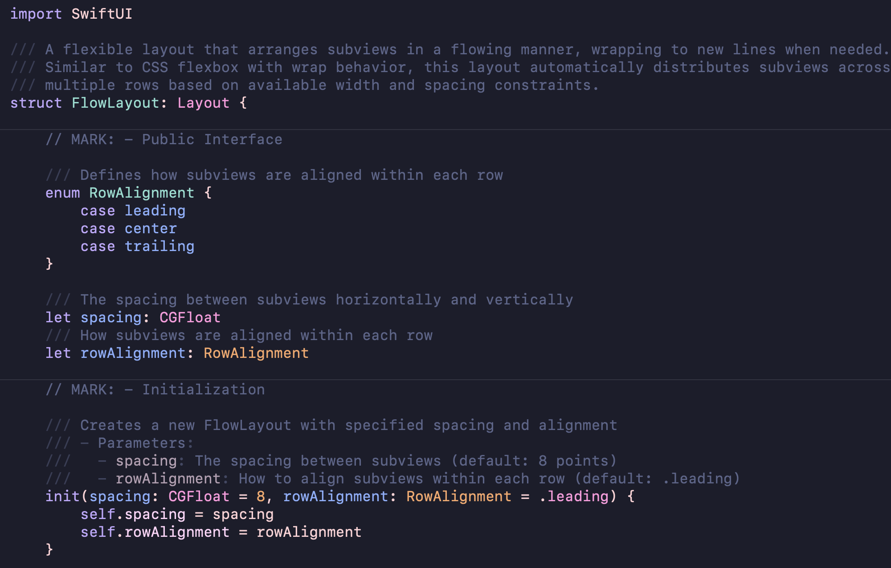
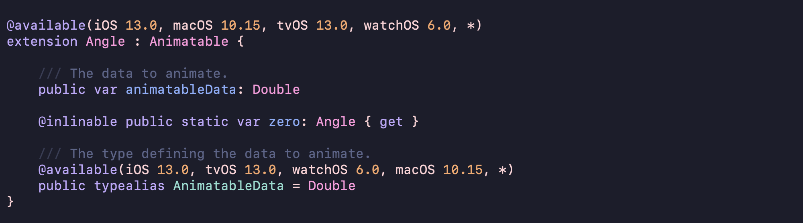
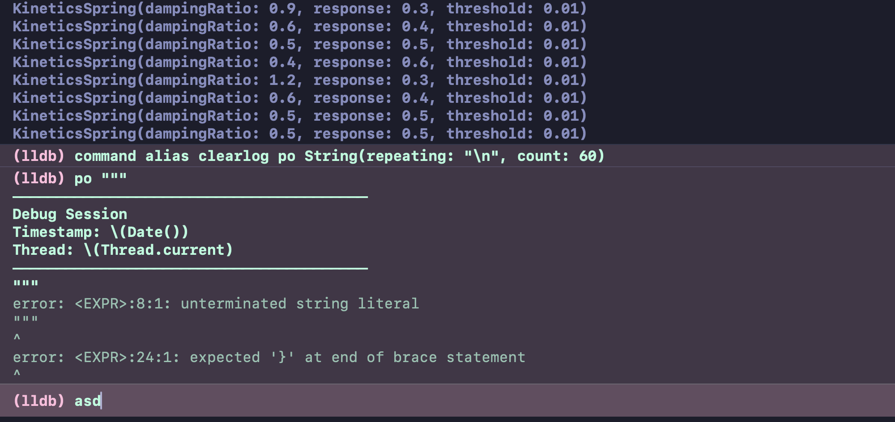

# Paris Noir

**A beautiful dark Xcode theme. Bonne nuit!**

Paris Noir is a carefully crafted dark theme for Xcode, designed for long nights, deep focus, and visual calm. Subtle contrast, soft highlights, and restrained colors reduce eye strain while keeping your code readable and expressive.

## Features
- Elegant, low-contrast dark palette  
- Excellent readability for Swift and Objective-C  
- Thoughtful syntax highlighting without visual noise  
- Ideal for late-night coding sessions  

## Installation
1. Download the `.xccolortheme` file  
2. Open Xcode  
3. Go to **Settings → Themes**  
4. Drag the theme file into the Themes list  

Alternatively, copy the file to:

```swift
~/Library/Developer/Xcode/UserData/FontAndColorThemes
```

## Screenshots

<p align="center">
  
</p>
<p align="center">
  
</p>
<p align="center">
  
</p>

## License
MIT